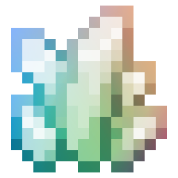
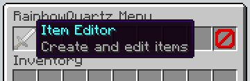
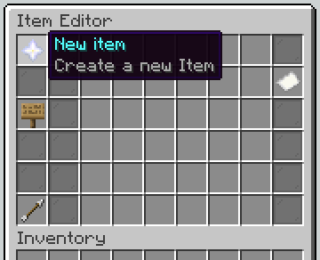
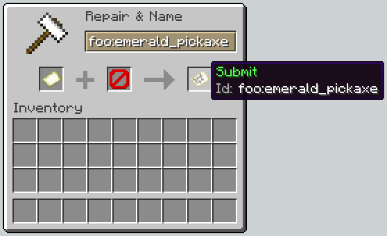
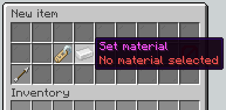
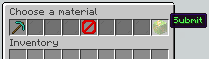
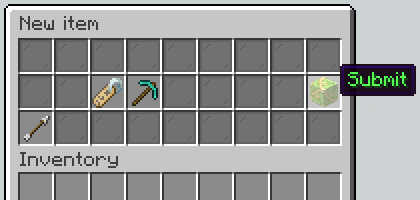

#  RainbowQuartz

[](https://github.com/olillin/RainbowQuartz/actions/workflows/build.yml)
[](https://app.codecov.io/gh/olillin/RainbowQuartz)

**RainbowQuartz** is an easy to use plugin for creating custom items.

## Features

- Creating custom items
- Editing basic properties of those items (name, lore, item type)
- Creating and editing recipes for those items
- Registering event handlers for custom items with API

### Planned features

- Live updates of pre-existing items on modification
- Registering event handlers in GUI
- Custom enchantments
- API support for registering custom recipe types

## Creating items

RainbowQuartz enables two ways of creating items: by [using the API in another plugin](#creating-items-with-the-api) or [with the in-game GUI](#creating-items-with-the-in-game-gui).

### Creating items with the API

<details open>
<summary>Kotlin example</summary>

#### MyPlugin.kt

```kotlin
val builder = ItemBuilder(NamespacedKey(this, "emerald_pickaxe"))
    .setName(Component.text("Emerald pickaxe")
        .color(NamedTextColor.GREEN))
    .addLore("Lorem ipsum")
    .addRecipe(
        ShapedRecipe("RRR", " S ", " S ")
            .setIngredient('R', Material.EMERALD)
            .setIngredient('S', Material.STICK))
RainbowQuartz.itemManager.registerDefault(builder.build())
```

</details>
<details>
<summary>Java example</summary>

#### MyPlugin.java

```java
ItemBuilder builder = new ItemBuilder(new NamespacedKey(this, "emerald_pickaxe"), Material.DIAMOND_PICKAXE, new ArrayList<>())
    .setName(Component.text("Emerald pickaxe")
         .color(NamedTextColor.GREEN))
    .addLore("Lorem ipsum")
    .addRecipe(
        new ShapedRecipe("RRR", " S ", " S ")
            .setIngredient('R', new Ingredient(Material.EMERALD, null))
            .setIngredient('S', new Ingredient(Material.STICK, null)));
RainbowQuartz.Companion.getItemManager().registerDefault(builder.build());
```

</details>

For more examples using the API have a look at the [RainbowQuartzExample](https://github.com/olillin/RainbowQuartzExample) plugin.

### Creating items with the in-game GUI

The GUI is the selling feature of RainbowQuartz, allowing for the creation and modfication of custom items all without restarting the server.

1. Open the GUI with the `/rainbowquartz` command

2. Open the **Item Editor**  
  

3. Click the **New item** button in the top left  
  

4. Set your item id  
  
  

5. Set your material by placing an item with the material from your inventory in the first slot.  
  
  

6. Click the `Submit` button


7. Modify any additional properties
8. Click the `Back` button to save the item
9. You've created your first item! 🎉
